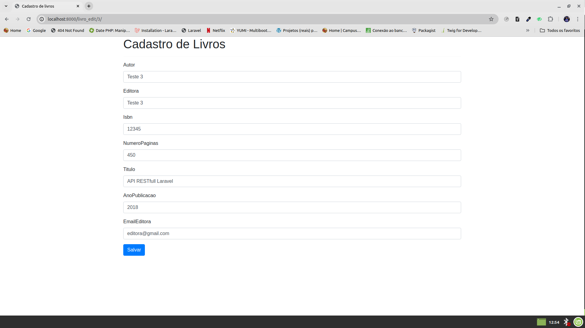
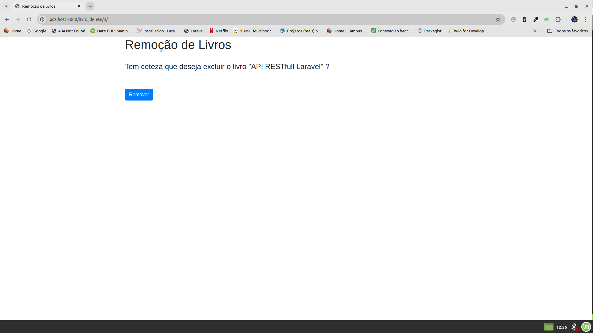

# Projeto Cadastro de Livros

Este é um projeto Django de cadastro de livros com Python 3. Ele permite que você gerencie informações sobre livros, incluindo título, autor, ano de publicação, entre outras.

## Funcionalidades

- **Listagem de Livros:** Exibe uma lista de todos os livros cadastrados no sistema.
- **Criação de Livros:** Permite adicionar novos livros ao sistema.
- **Edição de Livros:** Permite editar informações de livros existentes.
- **Exclusão de Livros:** Permite remover livros do sistema.

## Instalação

1. Clone o repositório:
   git clone https://github.com/pedro162/Livraria.git

2. Instale as dependências:
   pip install -r requirements.txt

## Uso

1. Inicie o servidor Django:
   python manage.py runserver

2. Acesse o aplicativo em seu navegador: [http://localhost:8000/](http://localhost:8000/)

## Páginas

### Listagem de Livros

- Exibe uma lista de todos os livros cadastrados.
- Permite visualizar detalhes de cada livro.
- Fornece opções para editar e excluir cada livro.

### Criação de Livros

- Permite adicionar novos livros ao sistema.
- Formulário com campos para inserir título, autor, ano de publicação e capa do livro.

### Edição de Livros

- Permite editar informações de livros existentes.
- Formulário pré-preenchido com os detalhes do livro selecionado.

### Excluisão de Livros

- Permite excluir um livro existente.
- Fornece detalhes do livro selecionado.

## Contribuição

Sinta-se à vontade para contribuir com este projeto! Se encontrar algum bug ou tiver alguma melhoria, por favor, abra uma issue ou envie um pull request.

## Licença

Este projeto está licenciado sob a Licença MIT. Consulte o arquivo [LICENSE](LICENSE) para obter detalhes.
